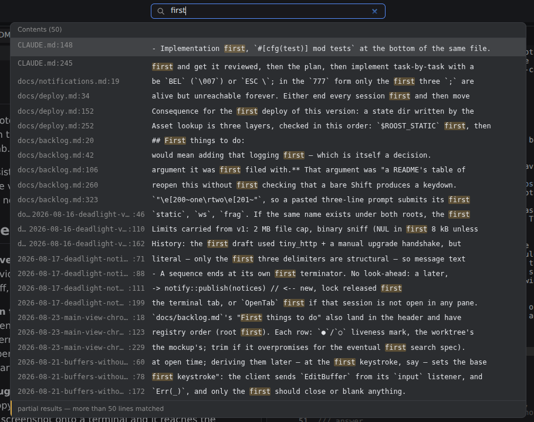
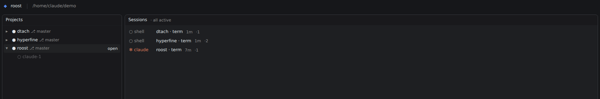

<div align="center">


# roost

**Your coding agents run on the server. This is where you watch them.**

A single Rust binary that gives every project a four-pane workspace in the browser —
file tree, editor, diffs and real terminals — backed by shells that survive the tab,
the network and a restart of roost itself.

[](https://github.com/PeterKnego/roost/releases)
[](#license)
[](https://www.rust-lang.org)


</div>

---

## Why

You moved Claude Code onto a real machine — a homelab box, a Hetzner server, a mini-PC
in the closet — because your laptop is not where 16 cores live. Now you need a window
into it that is not `ssh` + `tmux` + guessing what changed on disk.

roost is that window. Claude runs in a terminal pane and edits files; the viewer
reflects those edits live, so what you see is what is on disk — not a stale snapshot.
Close the lid, open it on the iPad, and the session is still running.

|                          | roost | ttyd / Wetty | code-server | tmux + ssh |
| ------------------------ | :---: | :----------: | :---------: | :--------: |
| Terminals survive restart |  ✅   |      ❌      |     n/a     |     ✅     |
| Editor + diffs + tree     |  ✅   |      ❌      |     ✅      |     ❌     |
| Mirrors across browsers   |  ✅   |      ❌      |     ❌      |     ✅     |
| Claude Code IDE protocol  |  ✅   |      ❌      |     ❌      |     ❌     |
| Paste a screenshot to the agent | ✅ |    ❌      |     ❌      |     ❌     |
| Single binary, no Node    |  ✅   |      ✅      |     ❌      |     ✅     |

## Install

```sh
# dtach and git must be on PATH
brew install dtach          # or: apt install dtach

cargo install --git https://github.com/PeterKnego/roost

ROOST_ROOTS="$HOME/Projects" roost 8444
# open http://127.0.0.1:8444/
```

Prebuilt Linux x86_64 binaries are on the [releases page](https://github.com/PeterKnego/roost/releases).
macOS is used daily; Windows is untested.

> **roost has no authentication of its own.** It binds `127.0.0.1` and refuses to do
> otherwise. Put something that authenticates in front of it — `tailscale serve` is
> what it was built against. Read [Security model](#security-model) before exposing it.

## What it does

### Four panes, universal tabs
Left-top, left-bottom, middle and right, with draggable dividers. One flat tab type —
file tree, git changes, editor, diff, terminal — and any tab can live in any pane.

### Terminals that outlive everything
Each terminal is a PTY owned by roost and wrapped in `dtach`, so sessions survive a
dropped tab *and* a roost restart. 1 MB scrollback per session, fanned out to every
attached client. Sessions that outlive a restart are rediscovered at startup; dead
sockets are reaped.

### All state lives on the server and mirrors live
Open a file in one browser and it opens in every connected browser. Layout and unsaved
buffers persist across restarts, stored outside the repo — so pane drags never show up
in `git status`.

### Claude Code sees the workspace
A `claude` running in a terminal pane connects back to roost as its IDE. It can point
at a file instead of pasting a path, and a file it proposes to change opens as a **diff
tab with Accept / Reject** — not eighty columns of terminal ASCII. The ✻ button next to
a tab strip's `+` opens a terminal with `claude` already typed in.


### Files go in through the browser
Drag files from the desktop onto the tree, or paste them there. Paste a **screenshot
onto a terminal** and it reaches the program running there as an actual image — which is
how you show Claude the thing you are looking at.

### Editing is conflict-guarded
Save refuses if the file changed on disk since your buffer opened, and shows a diff of
the changed hunks. A clean buffer follows external writes live; a dirty one is flagged
stale, never overwritten. Autosave writes a second after you stop typing and on blur,
through the same guard — and takes its hands off a diverged file rather than nagging.

### Project-wide search that reports what it skipped
`⇧⌃F` searches paths, contents and live session names in one list. It is a bounded walk,
not an index and not a subprocess — nothing to install, nothing to keep in sync. What it
*skipped* is reported rather than implied: unreadable directories are counted, a cap that
fired names itself, and "no matches" appears only when nothing went wrong.



### Sessions are visible and deliberate
Opening a project starts nothing. The header shows which projects have shells running,
with count and age. `Close Project` ends them all, keeps your layout, and refuses while
a buffer is unsaved.

### Desktop notifications
A process in a terminal — Claude finishing a task, a hook needing a decision — raises a
notification with one escape sequence or `roost notify`. It shows as a bell across every
project and, in a secure context, as an OS notification that clicks back to the terminal
that raised it. See [docs/notifications.md](docs/notifications.md).

<details>
<summary><b>Also: dot entries, worktrees overview, selection sharing, URL surface</b></summary>

**Dot entries are hidden until you say otherwise.** `.git`, `.claude`, build and vendor
directories are left out. The ◌ control in the tree header brings them back; the choice
mirrors and persists. `show_hidden = true` in `.roost/config.toml` sets the default.

**Projects / worktrees / sessions overview.** `/` is a two-pane overview: projects and
their worktrees on the left (each with Claude/dirty/ahead state), live sessions on the
right. Clicking a session opens its workspace with that terminal focused. `＋ Open a
directory` reaches the directory picker.



**Selection sharing (off by default).** `share_selection = true` sends whatever you have
highlighted in the editor to every connected Claude as ambient context. It ships file
contents with no explicit gesture — read [docs/deploy.md](docs/deploy.md) first. While on,
the header says `⧉ sharing selection`.

**URL surface**

| Path | Purpose |
| --- | --- |
| `/` | Projects/worktrees/sessions overview (`?at=` is the directory picker) |
| `/{project}` | Workspace — may be nested, e.g. `/karpie/src` |
| `/frag/{project}/…` | Server-rendered HTML fragments |
| `/ws/{project}/_workspace` | Workspace state socket — JSON intents up, events down |
| `/ws/{project}/term/{name}` | One raw-bytes socket per terminal |

</details>

## Security model

roost binds `127.0.0.1` only and is meant to be exposed by something that authenticates,
such as `tailscale serve`. The websocket spawns a shell, so the loopback bind is the
security boundary and is deliberately not configurable.

- WebSocket handshakes bypass the same-origin policy, so every socket checks `Origin`
  against an allowlist; HTTP checks `Host`/`X-Forwarded-Host` against the same list to
  defeat DNS rebinding.
- The allowlist is readable from the environment or global config only — never from a
  project's own `.roost/config.toml`, so a repo you clone cannot allowlist its own domain.
- HTTP is GET-only apart from two uploads (`POST /upload`, `POST /paste`). Every other
  state change travels over the websocket, so there is no state-changing verb for a
  hostile page to forge. Both POSTs check `Origin` and refuse a request that carries none.
- Every filesystem path is confined to the project directory by canonicalising and
  prefix-checking; creation paths canonicalise the parent and validate the final
  component separately.

## Documentation

- [docs/deploy.md](docs/deploy.md) — running, environment, deployment traps
- [docs/notifications.md](docs/notifications.md) — triggering, hooking up Claude Code, limits
- [CLAUDE.md](CLAUDE.md) — conventions and constraints for working in this repo
- [SECURITY.md](SECURITY.md) — what counts as a vulnerability here, and how to report one

<details>
<summary><b>The working record — specs, plans and the backlog, kept in the open</b></summary>

roost was built with the AI-assisted workflow it exists to serve, and the paper trail is
part of the repo because it explains why the code is the way it is.

- `docs/superpowers/specs/` and `docs/superpowers/plans/` — every feature's design
  document and the implementation plan that carried it out, dated, including the ones
  later reversed. They were written as briefs to an agent, not as user documentation,
  and they describe the code as it was on their date.
- `docs/backlog.md` — everywhere a spec said "later", gathered in one place. Not a
  roadmap; entries marked **Evidence** were measured against a real deployment, the rest
  were only ever imagined.

</details>

## License

Dual-licensed under [Apache-2.0](LICENSE-APACHE) or [MIT](LICENSE-MIT), at your option.
Bundled third-party front-end assets keep their own (permissive) licenses; attributions
are in `docs/vendor.md`.

Unless you state otherwise, any contribution you intentionally submit for inclusion, as
defined in the Apache-2.0 license, is dual licensed as above, with no additional terms.
