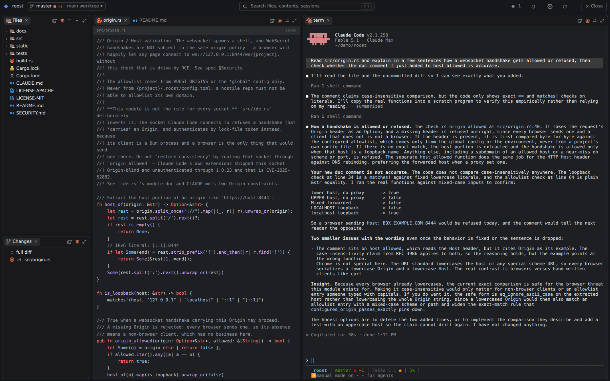
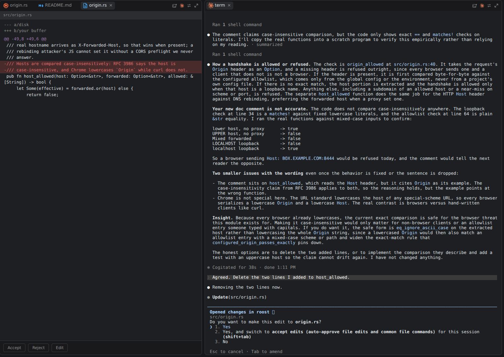

<div align="center">


# roost

**Run your long-running coding sessions on server. Watch them through your browser.**

This project started because I was scratching my itch: I wanted a simple remote termnal that survives any interruption, preferably runs through browser, and has a few must-haves: file tree, file upload, diff window, editor and preview. 
I managed to get by with mosh/tmux/md-tui, but that setup just did not understand projects and worktrees.
So I created a lightweight Rust tool that gives any coding project its own browser tab and all needed info in one place. Backed by `dtach` shells that survive tab close, laptop sleep, network down and even restart of `roost` itself.


[](https://github.com/PeterKnego/roost/actions/workflows/ci.yml)
[](https://github.com/PeterKnego/roost/releases)
[](#license)
[](https://www.rust-lang.org)



</div>

## Why

Because you want a simpler way to have remote access to your server box. Roost is a 4MB Rust binary that gives your every project or worktree a tab in a browser.

|                          | roost | ttyd / Wetty | code-server | tmux + ssh |
| ------------------------ | :---: | :----------: | :---------: | :--------: |
| Terminals survive restart |  ✅   |      ❌      |     n/a     |     ✅     |
| Editor + diffs + tree     |  ✅   |      ❌      |     ✅      |     ❌     |
| Mirrors across browsers   |  ✅   |      ❌      |     ❌      |     ✅     |
| Claude Code IDE protocol  |  ✅   |      ❌      |     ❌      |     ❌     |
| Paste a screenshot to the agent | ✅ |    ❌      |     ❌      |     ❌     |
| Single binary, no Node    |  ✅   |      ✅      |     ❌      |     ✅     |
| Auto-reconnects after the laptop sleeps | ✅ |    ❌      |     ✅      |     ❌     |
| Needed on the laptop      | browser | browser  |   browser   | ssh client + terminal |
| Drag-and-drop files to upload | ✅ |     ❌      |     ✅      |     ❌     |
| Multiple git worktrees, switchable | ✅ |   ❌      |     ❌      |     ❌     |
| Server binary             | 4 MB  |    0.7 MB    | 235 MB download | 1.3 MB |
| Server memory             | 16 MB (7 shells) | 9 MB (1 shell) | 770 MB (1 workspace) | 3 MB (1 shell) |

## Install

```sh
# dtach and git must be on PATH
brew install dtach          # or: apt install dtach

cargo install --git https://github.com/PeterKnego/roost

ROOST_ROOTS="$HOME/Projects" roost 8444
# open http://127.0.0.1:8444/
```

Prebuilt Linux x86_64 binaries are on the [releases page](https://github.com/PeterKnego/roost/releases).
macOS is used daily; Windows is untested.

> **roost has no authentication of its own.** It only binds to `127.0.0.1`. 
> Put auth layer in front of it - `tailscale serve` is what I use.
> Read [Security model](#security-model) before exposing it.

## Features

### A tab per project/worktree
Every tab represents project/worktree, and has panes in familiar IDE-like arrangemet: file-tree, file-diffs, file priview/editor, terminal.

### Terminals that survive reload/re-attach/restart
Each terminal is a PTY owned by `roost` and wrapped in `dtach`, so sessions survive a tab reload, network disconnect, laptop sleep, and even a `roost` restart. 

### All state lives on the server and mirrors live
Open a file in one browser and it opens in every connected browser. Layout and unsaved buffers persist across restarts, stored outside the repo — so pane drags never show up in `git status`.

### Drag-n-drop files/images or paste images 
Drag-n-drop files into file tree for instant upload to remote filesystem.
As for images, you can drag them or paste them into `claude` terminal and they will be uploaded and pasted directly into `claude` as image - this is a must-have feature when you just want to quickly paste a screenshot into claude for analysis.

### Claude Code integrates with the project
A `claude` running in a terminal pane connects back to `roost` via IDE protocol, same as VS Code or Jetbrains IDEs. This gives it unique integration abilities: paste image, links to @file, "live" links in terminal that open when clicking on it and `claude` initiated file diff viewer (if in manual permission mode).



### Desktop notifications
Roost supports sending desktop notifications from any terminal. Clicking notification will take you directly to that terminal.
Also, Roost can install hooks into `claude` to enable notification every time `claude` needs attention. See [docs/notifications.md](docs/notifications.md).

## Security model

`roost` only binds to `127.0.0.1` and is meant to be fronted by an auth layer,
such as `tailscale`. More about it in [SECURITY.md](SECURITY.md)


